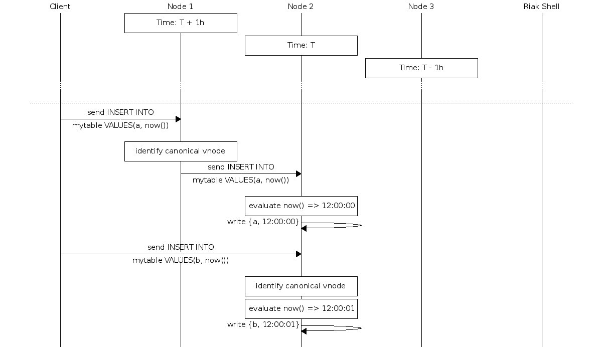

# Options For A Now() Function

## Introduction

This document outlines the options for a `now()` function in TS SQL

## Purpose

To outline the various technical options and their uses cases, pros and cons and enable the correct product decision to be made

## Scope

The scope of this document is a `now()` function in an `INSERT` statement.

```sql
INSERT INTO mytable VALUES("myfamily", "myseries", now(), "mypayload");
```

The use of `now()` in a `SELECT` statement is out of scope (and assumed to be fine and jim dandy).

# Statement Of The Problem

A **naïve** implementation of `now()` in an `INSERT` statement would result in inconsistent data with a very high frequency.

For the purposes of exposition we shall assume a 3 node Riak cluster with a client writing to it and a remote `riak-shell`

The three Riak nodes suffer from a 1 hour clock drift.

The client writes to the cluster with a load balancer.

Consider this execution path:


We see that the results return:
```
{b, 13:00:00}
{a, 12:00:01}
{c, 11:00:02}
```

These are out of order.

This problem never occurs with `riak-shell` because it always connects to the same riak node:


## The Correct Way

The correct way is to implement a consistent server-side timestamp path. That timestamp could be used with a SQL command like:

```sql
INSERT INTO mytable VALUES("a", now());
```

or in the `CREATE TABLE` command like:

```sql
CREATE TABLE GeoCheckin
(
   id           SINT64    NOT NULL,
   region       VARCHAR   NOT NULL,
   state        VARCHAR   NOT NULL,
   time         TIMESTAMP NOT NULL AUTO,
   weather      VARCHAR   NOT NULL,
   temperature  DOUBLE,
   PRIMARY KEY (
     (id, QUANTUM(time, 15, 'm')),
      id, time
   )
);
```

The execution flow is the same but different routing questions are asked - let us use the `INSERT INTO` statement for exposition purposes. We will only show the `client` path - the `riak-shell` one is trivially identical:



There are two variants on the ***correct way***:

* **strictly correct** if the canonical node isn't available the write fails
* **bit shit mode** if the canonical node isn't available go to fall back and let the guarantees go to hell in the proverbial

**Note**: oh, yeah, if you go ***bit shit*** yon John Daily runs you down in a banana-yella jeep, so there is that...

## Convenience Option

In this world `now()` in insert is seen as a convenience for play about and is optimised for onboarding and not production.

In this world we introduce a lexical token in the `riak-shell` that forces time serialisation in the `riak-client` only:


## Choices

I go for convenience option - targetted at onboarding - and if we are going to go down the correct route we should design and implement the `CREATE TABLE` version first and then add `now()` to the `INSERT INTO` path.
