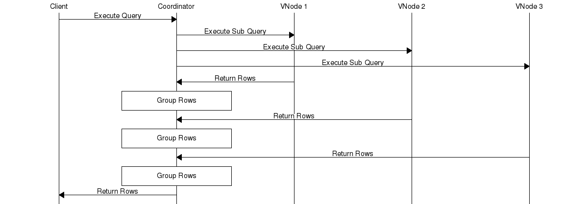
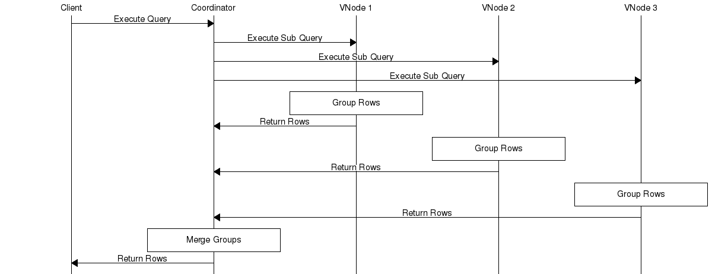

# Riak TS GROUP BY statement

### Reviewers

- [ ] [Brett Hazen](@javajolt)
- [ ] [John Daily](@mactintux)
- [ ] Rando from architecture
- [ ] Your name here.

### Definition

`GROUP BY` returns a single row for each unique combination of values for columns specified in the `GROUP BY` clause.  The `SELECT` clause for queries that use `GROUP BY` can contain only the columns in the `GROUP BY` and aggregate functions. Columns not used as groups can appear as function parameters.

The following table defines a schema for tasks, which project they are part of and when they were completed.

```sql
CREATE TABLE tasks (
    name VARCHAR NOT NULL,
    project VARCHAR NOT NULL,
    completed TIMESTAMP NOT NULL,
    PRIMARY KEY((name,project,quantum(completed,1,'m')),name,project,completed)
);
```

The query below returns one column per unique project and counts how many rows have the same project.

```
SELECT project, COUNT(name)
FROM tasks
GROUP BY project
```

Other variations.

```sql
/* Any number of groups, order has no effect */
SELECT project, COUNT(name)
FROM tasks
GROUP BY project, name

/* BEWARE of using a timestamp in the group, this can lead to a very large
   number of groups because it is likely to be unique */
SELECT project, name, completed
FROM tasks
GROUP BY project, name, completed

/* Columns do not have to be specified, any combination aggregate functions
   can be used */
SELECT COUNT(name)
FROM tasks
GROUP BY project, name

/* The column "completed" is not int he group clause but can be used
   as a function argument */
SELECT project, COUNT(completed)
FROM tasks
GROUP BY project
```

There is no guaranteed order for rows returned by `GROUP BY`, `ORDER BY` provides this.

### Technical Documentation

`GROUP BY` can be described as a dictionary of aggregates. When no `GROUP BY` is specified but an aggregate function is, only one row is returned. For example:

```sql
SELECT COUNT(project)
FROM table1
GROUP BY project
```

When a `GROUP BY` is specified, one aggregate is returned per group. Internally the coordinator maintains a dictionary is used, the key is the group by values and the value is the aggregate.



For each row in the result set, the coordinator must:

1. Fetch the `GROUP BY` key from the row cells.
2. Lookup the group's aggregate in the dictionary using the key.
    1. If no group exists for that key, create the initial state for the group's aggregate. 
3. "Fold" the row into the aggregate.
4. Put the aggregate back into the dictionary using the group key.

The `GROUP BY` key is a list of cell values, Given the the row and query, for the `tasks` table.

|   name  | project | completed |
|---------|---------|-----------|
| groupby | TS      |      5000 |

```sql
SELECT name, project
FROM tasks
GROUP BY name, project
```

The `GROUP BY` key for the row would be `[<<"groupby">>, <<"TS">>]`.

### Overload Protection

There is no special overload protection for queries using GROUP BY. It is not possible to put them into temporary tables because the accumulated groups all need to be in memory to be group on when processing new rows.

### Future Work

This proposal specifies how result sets from several vnodes can be grouped in the coordinator. The result set for each sub query could be grouped in the vnode before it was sent to the coordinator.  This could dramatically reduce the sub query result set as rows get grouped, and columns that are not referenced in the select clause are dropped. The savings being the network cost of sending an unprocessed result set and encoding/decoding it. If the group specification has many unique columns the saving will not be so great.

This is not being attempted now because the design for having the vnode and leveldb process results in general doesn't have a design yet.



### References

1. [SQL++ specification](http://arxiv.org/pdf/1405.3631v8.pdf)