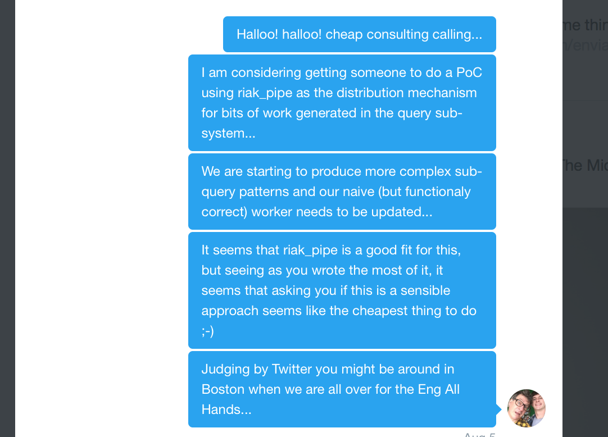
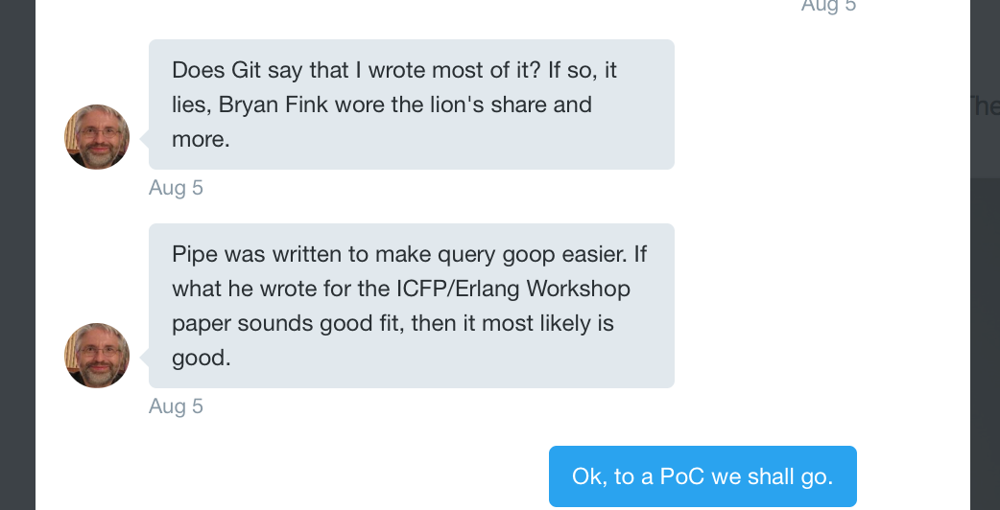

A PoC using Riak Pipe for query distribution RFC
------------------------------------------------

This RFC outlines a PoC to see if riak pipe is an appropriate mechanism to distribute query components around the ring for Riak TS instead of overlaying on the 2i riak_index gen_fsm system.

Purpose
-------

To determine if riak_pipe is a strategic mechanism to:
* distribute work aroud the cluster for querying
* manage workloads on cluster
* provide overload protection for the queries and replace the naive anti-overload approach in timeseries_query_max_quanta_span, riak_kv.timeseries_max_concurrent_queries and riak_kv.query.maximum_query_queue_length

Scope
-----

The scope of this RFC is:
* hacking in simple TS Select
* using a select query that the performance team has instrumented

Out of scope is:
* upgrade/downgrade
* production quality code
* any new tests

This should be a no-production chuck-away PoC - time bounded at a couple of weeks elapsed.

Prior Art
---------

The design of riak_pipe uses the Seda model - Staged Event-Driven Architecture - defined here:
https://www.eecs.harvard.edu/~mdw/papers/seda-sosp01.pdf

Due Diligence
-------------

The bold Scott Fritchie's name is all over the commit history so I done the dutiful:

Proposal
--------

riak_pipe is a mechanism for creating and running pipelines of activities that take data from a vnode

The riak_kv_qry_worker calls riak_kv_index_fsm_sup to start a riak_kv_index_fsm to distribute the sub-query around the vnode.

The FSM calls out to riak_kv_qry_coverage plan to generate a coverage plan for the query.

This query then 'appears' at the vnode.

The proposal is that a call to riak_pipe replace that call to riak_kv_index_fsm_sup

There is a tutorial on building a simple riak_pipe here:
https://www.erlang-factory.com/upload/presentations/798/euc2013-pipe.pdf

Outputs
-------

There are 3 outputs:
* a document review of the Seda paper to see if it provides a sensible basis for the implementation of a query system
* a quantitative estimate of the performance implications of switching to riak_pipe
* a qualitative assesment of riak_pipe becoming a core technology in the query sub-system