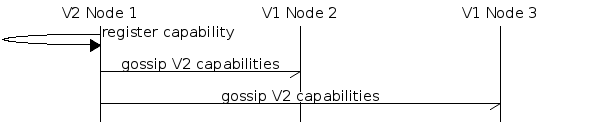
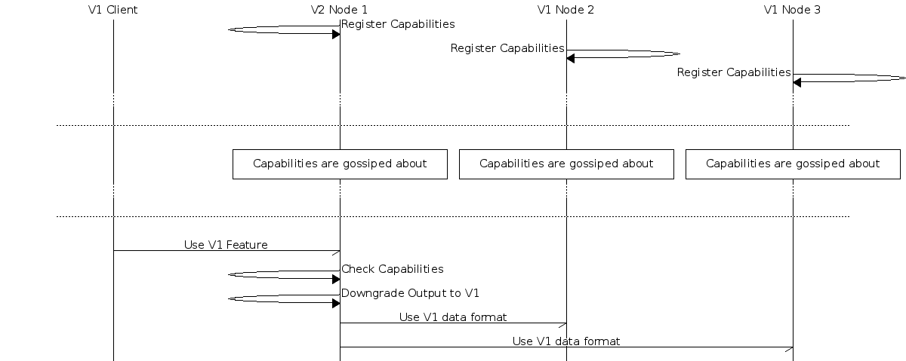
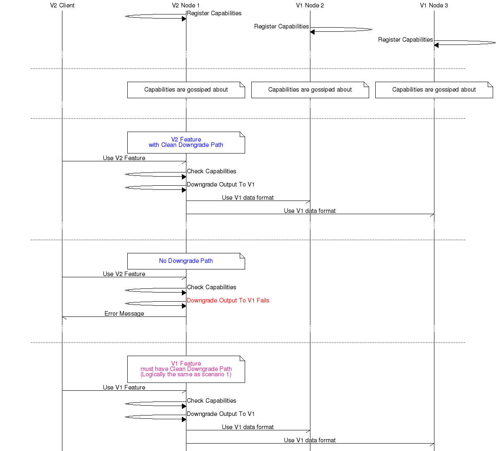
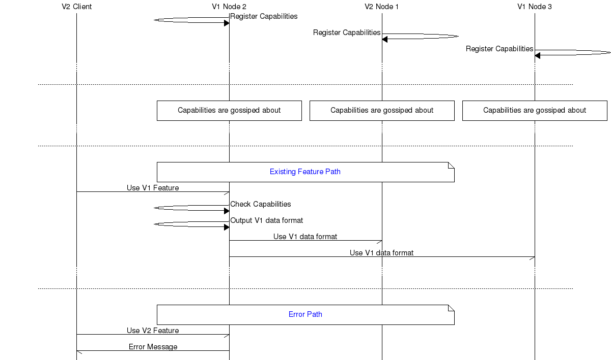
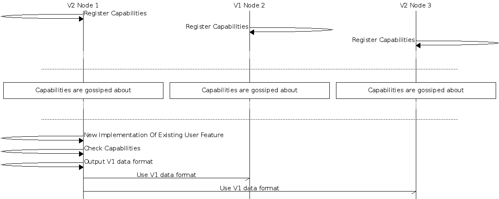
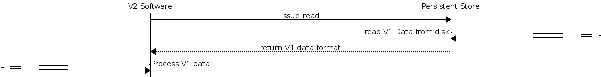
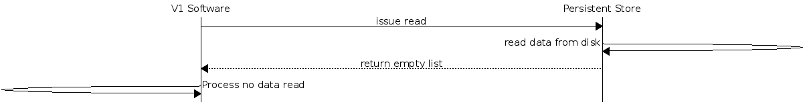
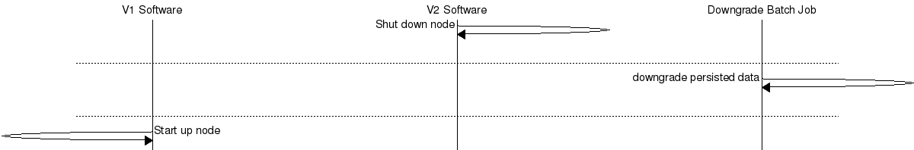

# Upgrade Downgrade Specifications

## Introduction

This document is designed to help in the review of technical design documents for features that require upgrade and downgrade compatibility.

## Purpose

To lead to better upfront-design of upgrade/downgrade and in-production documentation

## Scope

The scope of this document is:
* upgrading a cluster
* downgrading it
* running in mixed cluster mode for potentially long periods

## Usage

When the design document for a new feature that requires upgrade/downgrade capability is being reviewed the author and the reviewers should walk through the scenarios in this document until the reviewers are satisfied that the design can cope with all the scenarios that will exist in a mixed cluster.

If it turns out that there are subtle things missing in upgrade-downgrade that were not captured in the design of review process this document should be updated to reflect that.

## Capability Registration

The mechanism we use to signal the state of the cluster for a the purposes of upgrade/downgrade are riak capabilities. This is a feature of `riak_core` and you can read more about them in the [riak core capabilities module documentation](https://github.com/basho/riak_core/blob/develop/src/riak_core_capability.erl).

Capabilities are registered at application startup.

## When Is Upgrade Downgrade Needed?

Upgrade/downgrade is needed in 2 distinct circumstances:
* when a data format that is exchanged between nodes is changed
* when format-on-disk is changed

API changes withing modules that are on the same physical node do _**not**_ require upgrade/downgrade

## New User Feature

In these next 4 scenarios a change is introduced which offers a new feature to the end user - and the expression of that new functionality needs to be managed.

### Scenario 1

In this scenario an old client talks to a new node in a mixed cluster

### Scenario 2

This scenario shows when a new client is used to connect to a new node in a mixed cluster.

**NOTE**: because SQL commands are plain text - it is possible for old clients to **post commands from the future**

### Scenario 3

An old client connects to a old node in a mixed cluster.

**NOTE**: because SQL commands are plain text - it is possible for old clients to **post commands from the future**

### Scenario 4

An new client connects to an old node in a mixed cluster.

## Internal Upgrade Of A Wire Format

The next scenario relates to the updating of a existing feature in situ - say a performance improvement. This leads to better non-functionals for the customer - but no functional changes.

### Scenario 5

A new internal wire format is introduced for inter-node communications. In this case the new implementation is required to downgrade to the old one if not supported.

**Note**: this scenario is for non-client facing changes only

# Upgrade Of Node Over Persisted Data

### Scenario 6

In this scenario data is written to disk in Version 1 of the software, and the node is upgraded or downgraded in place, and the new software attempts to read the persisted data.

**Note**: this **MUST** be considered from 3 perspectives:
* data written to Riak
* AAE derived from the persisted data
* metadata written elsewhere, eg Riak Core, DDL beam files, etc, etc

### Scenario 7

In this scenario a node has been downgraded in place and the old version of the software attempts to read data from a vnode containing new format data. The new format data SHOULD be invisible to the old software - if this is not possible see Scenario 8.

Especial consideration needs to be given to maintenance systems that access the V2 data in this scenario, including, not not restricted to:
* AAE
* handoff
* MDC

**Note**: this **MUST** be considered from 3 perspectives:
* data written to Riak
* AAE derived from the persisted data
* metadata written elsewhere, eg Riak Core, DDL beam files, etc, etc

**Note**: in this scenario the new features MUST be separately enabled from a command line tool and the CLI MUST tell users that if they switch this feature on there is no going back... The proposal for this scenario MUST be reviewed by the CSE team

Here are two examples of non-backward compatible features, one bad and one good:

Good: Bucket Types. There is a UI moment that makes it painfully clear that this move will cause data to be written in a form that is unreadable by the previous version. Strictly opt-in by the user.

Bad: Bitcask small keys. Upon upgrade to a version that supported small keys, users were opted in to that behavior causing all data written after upgrading a node to be unreadable by the previous version of Bitcask. Users who needed to easily be able to roll back had to be told to opt-out of small keys via the configuration, or spend a lot of time with a recovery step (à la Scenario 8) to revert the keys to the previous format.

### Scenario 8 - (the bad scenario, don't do it!)

In scenario the data on disk needs to be converted back to V1. This is deeply inadvisable - but may be appropriate for low data volumes - eg meta data or other other things in riak core.

In this scenario the vnode is stopped, the data is transformed in situ and the old version is started.

**Note**: this **MUST** be considered from 3 perspectives:
* data written to Riak
* AAE derived from the persisted data
* **SOME** metadata written elsewhere, eg DDL beam files, etc, etc

Metadata written to Riak Core **MUST** be immutable and not rewritten - if the application needs to transform and upgrade data in `riak_core` it MUST store that transformed data elsewhere - an example is upgrading a `#ddl_v1{}` record. If the transform is done *in place* is makes the job of downgrading more complex and sometimes impossible.

**Note**: this should only be considered if Scenario 7 cannot be implemented

**Note**: the proposal for this scenario MUST be reviewed by the CSE team
