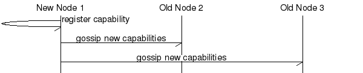
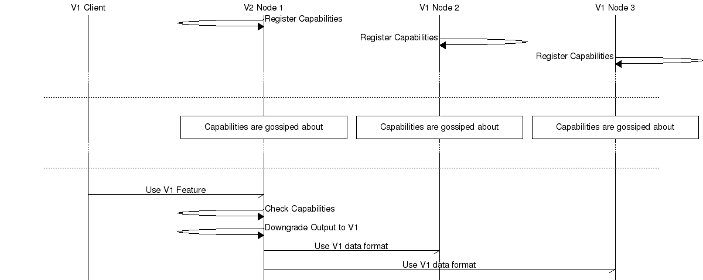
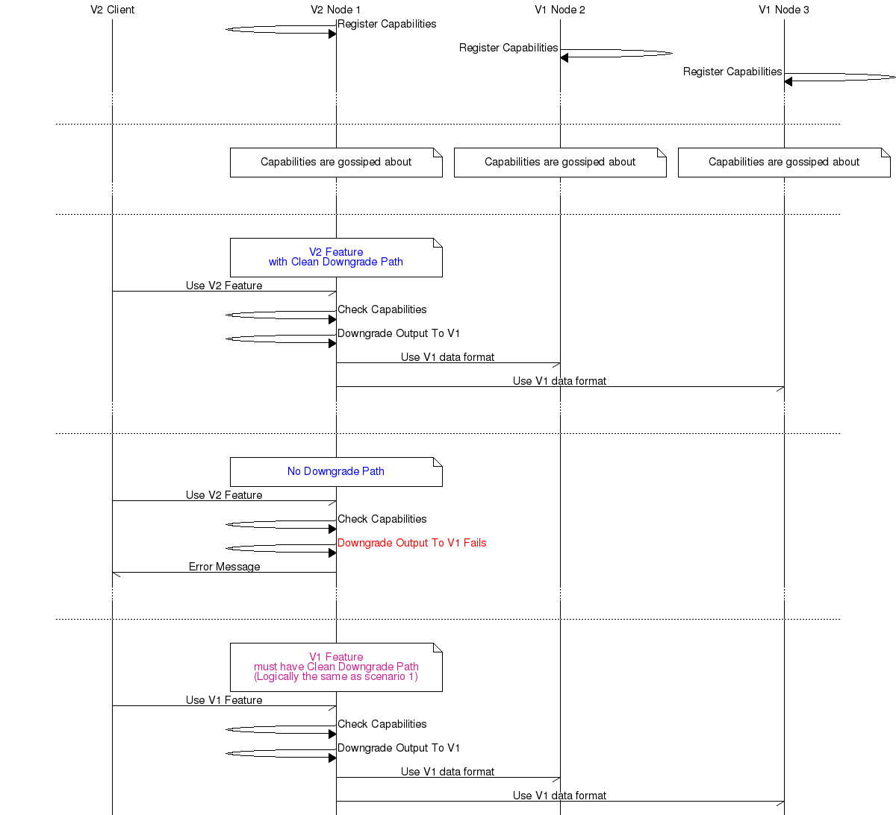
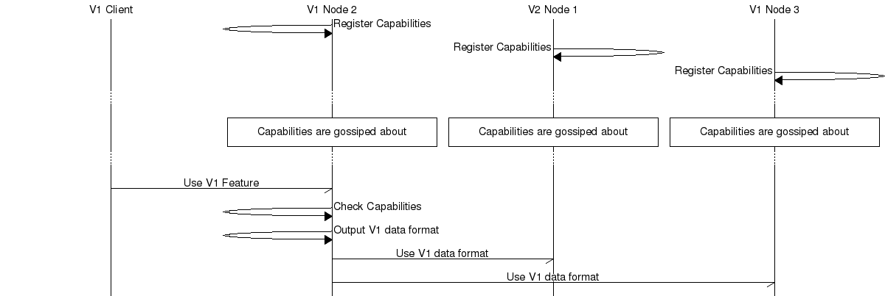
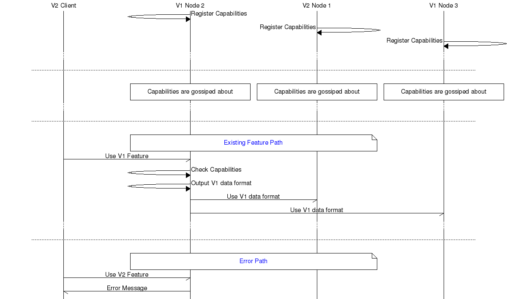
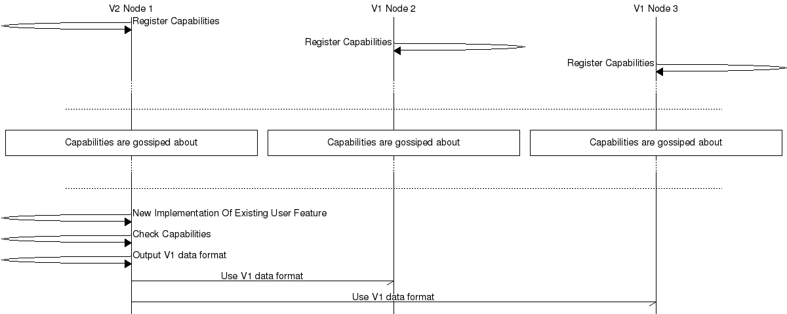
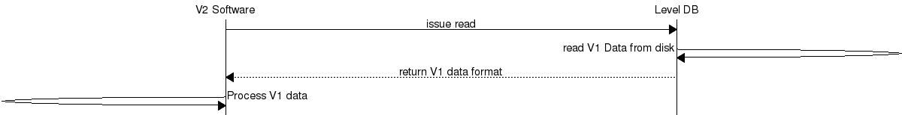
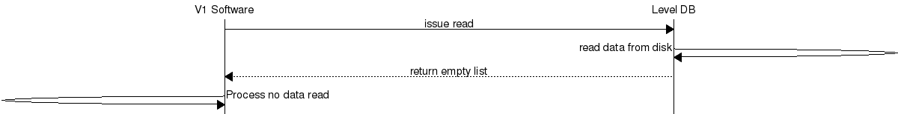
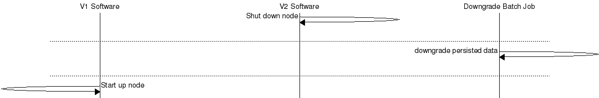

# Upgrade Downgrade Specifications

## Introduction

This document explains how to specify upgrade/downgrades.

## Purpose

To lead to better upfront-design of upgrade/downgrade and in-production documentation

## Scope

The scope of this document is:
* upgrading a cluster
* downgrading it
* running in mixed cluster mode for potentially long periods

## Usage

This document pertains to any change where a data format that is exchanged between two nodes is changed in any way...

## Contents

This document covers:
* how capabilities are registered
* how riak_core works
* the criteria for using this document

## Capability Registration

Capabilities are registered at application startup.

## When Is Upgrade Downgrade Needed?

Upgrade/downgrade is needed in 2 distinct circumstances:
* when a data format that is exchanged between nodes is changed
* when format-on-disk is changed

API changes withing modules that are on the same physical node do _**not**_ require upgrade/downgrade

## New User Feature

In these next 4 scenarios a change is introduced which offers a new feature to the end user - and the expression of that new functionality needs to be managed.

### Scenario 1

In this scenario an old client talks to a new node in a mixed cluster

### Scenario 2

This scenario shows when a new client is used to connect to a new node in a mixed cluster.

### Scenario 3

An old client connects to a old node in a mixed cluster.

### Scenario 4

An new client connects to an old node in a mixed cluster.

## Internal Upgrade Of A Wire Format

The next scenario relates to the updating of a existing feature in situ - say a performance improvement. This leads to better non-functionals for the customer - but no functional changes.

## Scenario 5

A new internal wire format is introduced for inter-node communications. In this case the new implementation is required to downgrade to the old one if not supported.

# Upgrade Of Node Over Persisted Data

## Scenario 6

In this scenario data is written to disk in Version 1 of the software, and the node is upgraded or downgraded in place, and the new software attempts to read the persisted data.

## Scenario 7

In this scenario a node has been downgraded in place and the old version of the software attempts to read data from a vnode containing new format data. The new format data SHOULD be invisible to the old software - if this is not possible see Scenario 8.

Especial consideration needs to be given to maintenance systems that access the V2 data in this scenario, including, not not restricted to:
* AAE
* handoff
* MDC

## Scenario 8

In scenario the data on disk needs to be converted back to V1. This is deeply unadvisable - but may be appropriate for low data volumes - eg meta data or other other things in riak core.

In this scenario the vnode is stopped, the data is transformed in situ and the old version is started.

