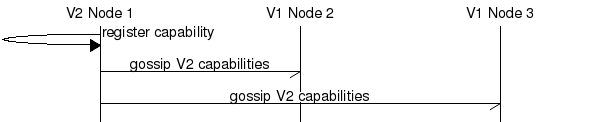

# Upgrade Downgrade Specifications

## Introduction

This document explains how to specify upgrade/downgrades.

## Purpose

To lead to better upfront-design of upgrade/downgrade and in-production documentation

## Scope

The scope of this document is:
* upgrading a cluster
* downgrading it
* running in mixed cluster mode for potentially long periods

## Usage

This document pertains to any change where a data format that is exchanged between two nodes is changed in any way...

## Contents

This document covers:
* how capabilities are registered
* how riak_core works
* the criteria for using this document

## Capability Registration

Capabilities are registered at application startup.

## When Is Upgrade Downgrade Needed?

Upgrade/downgrade is needed in 2 distinct circumstances:
* when a data format that is exchanged between nodes is changed
* when format-on-disk is changed

API changes withing modules that are on the same physical node do _**not**_ require upgrade/downgrade

## New User Feature

### Scenario 1

This scenario shows the introduction of an new client feature to a cluster which is accessed by old clients only.

### Scenario 2

This scenario shows when a new client is used.

### Scenario 3

An old client connects to a old node in a mixed cluster.

### Scenario 4

An new client connects to an old node in a mixed cluster.

